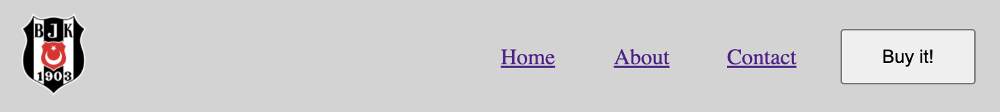

# Instructions  

---

Use what you've learned so far with flexbox to create this header:

The logo in the left can be found at this URL:
`https://upload.wikimedia.org/wikipedia/commons/thumb/2/20/Logo_of_Be%C5%9Fikta%C5%9F_JK.svg/640px-Logo_of_Be%C5%9Fikta%C5%9F_JK.svg.png`

The HTML links and the button you see above are just the defaults (no styling).

There is 10px of padding all around the image on the left. There is 20px of padding around the element containing all of the links and the button.